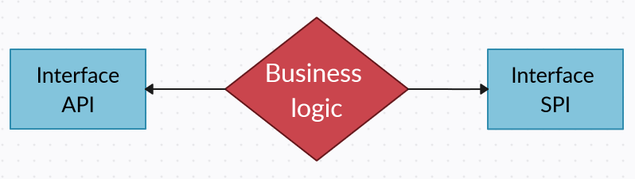
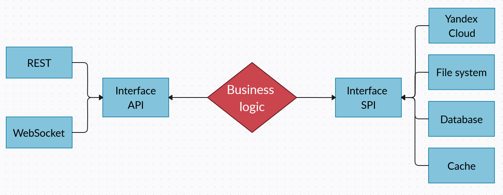

# Clean Architecture. 
## Image Storage Service. The third iteration

**Division into modules** 

The next logical step is to divide the project into separate modules.

**Solution:** 

We will allocate it to a separate Local module and to a separate Yandex module.
We will also place the controller in a separate module, 
since it is also not a business logic and in the future we may want to send files using other options.

* Module storage-common
  Our 2 models live here, which are operated by our business logic.
* The modules of the incoming and outgoing port interfaces.: storage-api, storage-spi
* A module with business logic: storage-core
  It depends on the interface of the incoming and outgoing ports and the module with models.
* One implementation of the incoming port: FileStorageRestController
* Two outgoing port implementations: LocalFileSystemService, YandexCloudService
  The implementation with writing to disk and the implementation of writing to Yandex.
* Independent implementations based on the created components (modules): 
  microservice-api-webmvc-spi-local-filesystem, microservice-api-webmvc-spi-yandex-cloud 
  The whole difference between these two applications is in the choice of service.

**Conclusion** 

We have come to the conclusion that we can develop each module independently. Each service should be updated and 
deployed independently and only with the dependencies it needs, where there is nothing superfluous. We can easily 
create new adapters for whatever we want.

In total, there is a business logic and an interface for incoming and outgoing ports: 

And then we can do whatever we want with regard to where the data comes from and where it goes: 

It all depends on the interfaces. 
